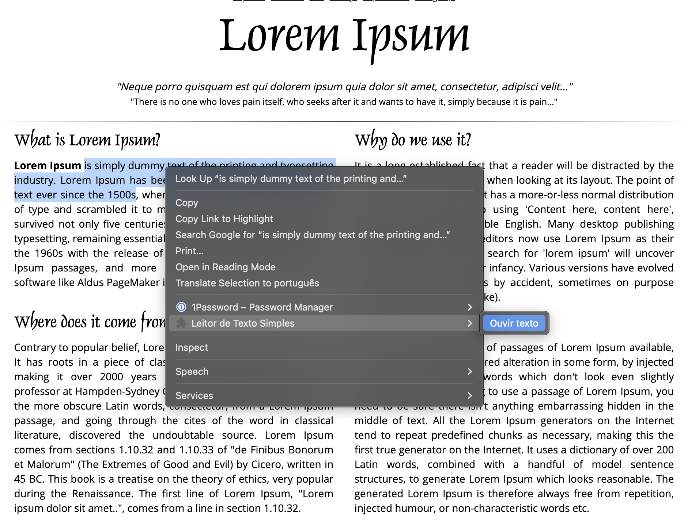

# Leitor de Texto Simples 🔊

Uma extensão do Chrome que permite ouvir qualquer texto selecionado em uma página web usando a funcionalidade de Text-to-Speech (TTS) nativa do navegador. A interação é simples e intuitiva através do menu de contexto do botão direito.



## 🎯 Funcionalidades

### ✨ Leitura de Texto
- **Seleção e Leitura**: Selecione qualquer texto e clique com o botão direito para ouvi-lo
- **Voz Nativa**: Usa a voz configurada no seu navegador ou sistema operacional
- **Controle Total**: Iniciar, pausar, retomar e parar a leitura a qualquer momento

### 🎛️ Controles de Voz
- **Menu Contextual**: Opções "Ouvir texto", "Parar leitura", "Pausar leitura", "Continuar leitura"
- **Atalhos de Teclado**: 
  - `Ctrl+Shift+S` para parar a leitura
  - `Ctrl+Shift+P` para pausar/retomar a leitura
- **Controle Automático**: Menu se adapta automaticamente ao estado da leitura

### 🔧 Funcionalidades Técnicas
- **API Nativa**: Usa a Web Speech API do navegador
- **Sem Dependências**: Não requer APIs externas ou bibliotecas
- **Performance**: Leve e eficiente
- **Compatibilidade**: Funciona em todos os sites

## 🚀 Instalação

### Desenvolvimento
1. Instale as dependências:
   ```bash
   npm install
   ```

2. Construa o projeto:
   ```bash
   npm run build
   ```

3. Carregue a extensão no Chrome:
   - Abra `chrome://extensions/`
   - Ative o "Modo do desenvolvedor"
   - Clique em "Carregar sem compactação"
   - Selecione a pasta `dist`

### Produção
1. Baixe o arquivo ZIP da última versão
2. Extraia o arquivo
3. Siga os passos 3 da instalação de desenvolvimento

## 🛠️ Scripts Disponíveis

- `npm run build` - Constrói o projeto para produção
- `npm run dev` - Inicia o modo de desenvolvimento com watch
- `npm run clean` - Remove a pasta dist
- `npm run package` - Cria um arquivo ZIP para distribuição

## 🎮 Como Usar

### Uso Básico
1. **Selecione o texto** que deseja ouvir em qualquer página web
2. **Clique com o botão direito** para abrir o menu de contexto
3. **Clique em "Ouvir texto"** para iniciar a leitura
4. **Use os controles** para pausar, retomar ou parar a leitura

### Controles Disponíveis
- **Ouvir texto**: Inicia a leitura do texto selecionado
- **Parar leitura**: Para completamente a leitura
- **Pausar leitura**: Pausa a leitura atual
- **Continuar leitura**: Retoma a leitura pausada

### Atalhos de Teclado
- **Ctrl+Shift+S**: Parar a leitura
- **Ctrl+Shift+P**: Pausar/Retomar a leitura

## 🏗️ Arquitetura

### Estrutura do Projeto
```
leitor-de-texto-simples/
├── src/
│   ├── background/          # Service Worker
│   │   └── background.ts    # Gerenciamento de estado e menu
│   ├── content/             # Content Script
│   │   └── speaker.ts       # Funcionalidade de TTS
│   ├── types/               # Definições TypeScript
│   │   └── interfaces.ts
│   └── utils/               # Funções utilitárias
├── icons/                   # Ícones da extensão
├── manifest.json            # Configuração da extensão
└── package.json             # Dependências e scripts
```

### Tecnologias Utilizadas
- **TypeScript**: Tipagem estática e melhor experiência de desenvolvimento
- **Webpack**: Bundling e otimização de assets
- **Chrome Extension API**: Integração com o navegador
- **Web Speech API**: Síntese de voz nativa
- **Chrome Context Menus API**: Menu de contexto
- **Chrome Scripting API**: Injeção de scripts

## 🔧 Configuração

### Permissões
A extensão requer as seguintes permissões:
- `contextMenus`: Para criar o menu de contexto
- `scripting`: Para injetar o content script
- `activeTab`: Para acessar a aba ativa

### Dados Armazenados
- **Estado da Fala**: Status atual da leitura
- **Preferências**: Configurações de voz e comportamento
- **Estatísticas**: Uso da extensão (opcional)

## 🎨 Personalização

### Vozes Disponíveis
- A extensão usa as vozes instaladas no seu sistema
- Suporta múltiplos idiomas
- Detecta automaticamente a voz preferida

### Configurações
- **Taxa de Fala**: Velocidade da leitura
- **Tom da Voz**: Altura da voz
- **Volume**: Volume da leitura
- **Idioma**: Idioma preferido

## 🐛 Solução de Problemas

### Problemas Comuns

**A extensão não aparece no menu de contexto:**
- Verifique se o texto está selecionado
- Recarregue a página e tente novamente
- Verifique se a extensão está ativada

**A leitura não funciona:**
- Verifique se o seu navegador suporta Web Speech API
- Verifique se há vozes instaladas no sistema
- Tente selecionar um texto menor

**O menu não muda de estado:**
- Recarregue a extensão em `chrome://extensions/`
- Verifique o console para erros

### Logs de Debug
Abra o console do navegador (F12) para ver logs detalhados da extensão.

## 🤝 Contribuindo

### Áreas para Contribuição
- Adicionar novos idiomas
- Melhorar a qualidade da voz
- Sugerir novas funcionalidades
- Reportar bugs
- Melhorar a documentação

## 📝 Licença

Este projeto está licenciado sob a Licença MIT - veja o arquivo [LICENSE](LICENSE) para detalhes.

## 🙏 Agradecimentos

- Web Speech API para funcionalidade de síntese de voz
- Chrome Extension API para integração com o navegador
- Comunidade de desenvolvedores de extensões Chrome

## 📞 Suporte

Se você encontrar algum problema ou tiver sugestões:
- **Email**: anielleandrade.developer@gmail.com

---

**Transforme qualquer texto em áudio com um clique! 🔊**
